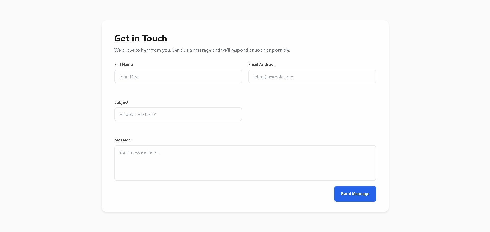

# 🤖 AI-Powered Contact Form

A smart contact form that automatically generates personalized AI replies and logs submissions — built with vanilla HTML, CSS, JavaScript, and powered by Zapier automation.



---

## ✨ Features

- Real-time form validation (empty fields, email format)
- Loading spinner during submission
- Celebratory success animation
- Error handling with retry option
- Instant AI-generated personalized email reply
- Automatic logging to Google Sheets
- Mobile responsive design
- Clean minimalist UI with smooth transitions

---

## 🔄 How It Works

1. User fills out the contact form (name, email, subject, message)
2. Form validates inputs and submits to Zapier webhook
3. Zapier triggers AI by Zapier to generate a personalized reply
4. Gmail automatically sends the AI response to the user
5. Submission data is logged to Google Sheets
6. User sees success message in the browser

---

## 🛠️ Tech Stack

**Frontend:**
- HTML5
- CSS3 (custom variables, animations)
- JavaScript (ES6+)

**Backend / Automation:**
- [Zapier](https://zapier.com/) — webhook automation
- [AI by Zapier](https://zapier.com/apps/ai/integrations) — personalized response generation
- [Gmail](https://gmail.com/) — automated email sending
- [Google Sheets](https://sheets.google.com/) — data logging

---

## 📁 File Structure

zapier-contact-form/
- `index.html` — form structure and markup
- `style.css` — styling, animations, and responsive design
- `script.js` — validation, submission, and UI state logic
- `README.md` — project documentation

---

## 🚀 Getting Started

### 1. Clone the repo:
```bash
git clone https://github.com/mors-codes/zapier-contact-form.git
cd zapier-contact-form
```

### 2. Set up Zapier workflow:

**Create a new Zap:**
1. **Trigger:** Webhooks by Zapier → Catch Hook
2. Copy the webhook URL

**Add Actions:**
1. **AI by Zapier** → Generate personalized reply based on user's message
2. **Gmail** → Send email with AI-generated response to user
3. **Google Sheets** → Add row with submission data (name, email, subject, message, timestamp)

### 3. Configure the webhook:

Open `script.js` and replace the placeholder URL:
```javascript
const WEBHOOK_URL = 'https://hooks.zapier.com/hooks/catch/YOUR_ACTUAL_WEBHOOK_URL/';
```

### 4. Test it out:

Open `index.html` in your browser — done!

> No installs, no build steps, no dependencies.

---

## 📋 Google Sheets Structure

Your spreadsheet should have these columns:
- Full Name
- Email
- Subject
- Message
- Timestamp

---

## 🎨 Design Details

- Off-pure colors (no pure black/white)
- Blue primary color (#2563eb)
- Success animations with pulse effect
- Error animations with shake effect
- Focus states with blue glow
- Smooth color transitions (0.2s ease)

---

## 📄 License

This project is open source and available under the [MIT License](LICENSE).